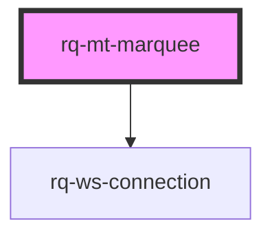

# rq-mt-marquee

<!-- Auto Generated Below -->

## Properties

| Property     | Attribute   | Description | Type                                                                                                                                                                                                                               | Default                                                                                                                                                                                                                                                                                                                                                                                                                                                                                                                                                                                                                                                                                                                                                                                                                                                                                                                                                                                                                                                                                                                                                                                                                                                                 |
| ------------ | ----------- | ----------- | ---------------------------------------------------------------------------------------------------------------------------------------------------------------------------------------------------------------------------------- | ----------------------------------------------------------------------------------------------------------------------------------------------------------------------------------------------------------------------------------------------------------------------------------------------------------------------------------------------------------------------------------------------------------------------------------------------------------------------------------------------------------------------------------------------------------------------------------------------------------------------------------------------------------------------------------------------------------------------------------------------------------------------------------------------------------------------------------------------------------------------------------------------------------------------------------------------------------------------------------------------------------------------------------------------------------------------------------------------------------------------------------------------------------------------------------------------------------------------------------------------------------------------- |
| `animation`  | `animation` |             | `boolean`                                                                                                                                                                                                                          | `true`                                                                                                                                                                                                                                                                                                                                                                                                                                                                                                                                                                                                                                                                                                                                                                                                                                                                                                                                                                                                                                                                                                                                                                                                                                                                  |
| `connection` | --          |             | `WebsocketConnection \| { endpoints: string \| string[]; apiKey: string; apiHost: string; channels: string \| string[]; snapshot?: boolean \| "asc" \| "desc"; snapshot_size?: number; user_id?: string; env?: "dev" \| "prod"; }` | `undefined`                                                                                                                                                                                                                                                                                                                                                                                                                                                                                                                                                                                                                                                                                                                                                                                                                                                                                                                                                                                                                                                                                                                                                                                                                                                             |
| `namespace`  | `namespace` |             | `string`                                                                                                                                                                                                                           | `'rq-mt-marquee'`                                                                                                                                                                                                                                                                                                                                                                                                                                                                                                                                                                                                                                                                                                                                                                                                                                                                                                                                                                                                                                                                                                                                                                                                                                                       |
| `repeat`     | `repeat`    |             | `number`                                                                                                                                                                                                                           | `3`                                                                                                                                                                                                                                                                                                                                                                                                                                                                                                                                                                                                                                                                                                                                                                                                                                                                                                                                                                                                                                                                                                                                                                                                                                                                     |
| `symbols`    | --          |             | `TradeSymbol[]`                                                                                                                                                                                                                    | `[         { key: 'BTCUSDm', label: 'BTC/USD' },         { key: 'XAUUSDm', label: 'Gold/USD' },         { key: 'EURUSDm', label: 'EUR/USD' },         { key: 'USOILm', label: 'US Oil' },         { key: 'ETHUSDm', label: 'ETH/USD' },         //         { key: 'EURUSDm', label: 'EUR/USD' },         { key: 'USDJPYm', label: 'USD/JPY' },         { key: 'GBPUSDm', label: 'GBP/USD' },         { key: 'USDCHFm', label: 'USD/CHF' },         { key: 'USDCADm', label: 'USD/CAD' },         //         { key: 'USTECm', label: 'US Tech 100' },         { key: 'UK100m', label: 'UK 100 Index' },         { key: 'STOXX50m', label: 'EU 50 Index' },         { key: 'HK50m', label: 'HK 50 Index' },         { key: 'DE30m', label: 'DE 30 Index' },         //         { key: 'XAUUSDm', label: 'Gold/USD' },         { key: 'XAGUSDm', label: 'Silver/USD' },         { key: 'USOILm', label: 'US Crude Oil' },         { key: 'XPDUSDm', label: 'Palladium/USD' },         { key: 'XPTUSDm', label: 'Platinum/USD' },         //         { key: 'AAPLm', label: 'Apple' },         { key: 'BABAm', label: 'AliBaba' },         { key: 'Cm', label: 'CitiGroup' },         { key: 'KOm', label: 'CocaCola' },         { key: 'NFLXm', label: 'Netflix' },     ]` |
| `timeframe`  | `timeframe` |             | `TimeFrame.D1 \| TimeFrame.H1 \| TimeFrame.MN1 \| TimeFrame.W1`                                                                                                                                                                    | `TimeFrame.D1`                                                                                                                                                                                                                                                                                                                                                                                                                                                                                                                                                                                                                                                                                                                                                                                                                                                                                                                                                                                                                                                                                                                                                                                                                                                          |

## Dependencies

### Depends on

-   [rq-ws-connection](../rq-ws-connection)

### Graph

---

_Built with [StencilJS](https://stenciljs.com/)_
