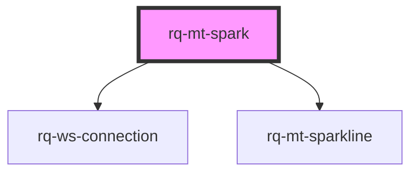

# rq-mt-spark

<!-- Auto Generated Below -->

## Properties

| Property     | Attribute     | Description | Type                                                                                                                                                                  | Default         |
| ------------ | ------------- | ----------- | --------------------------------------------------------------------------------------------------------------------------------------------------------------------- | --------------- |
| `connection` | --            |             | `WebsocketConnection \| { endpoints: string \| string[]; apiKey: string; apiHost: string; channels: string \| string[]; snapshot?: boolean; env?: "dev" \| "prod"; }` | `undefined`     |
| `display`    | `display`     |             | `"default" \| "reverse"`                                                                                                                                              | `'default'`     |
| `maxHistory` | `max-history` |             | `number`                                                                                                                                                              | `30`            |
| `namespace`  | `namespace`   |             | `string`                                                                                                                                                              | `"rq-mt-spark"` |
| `symbol`     | --            |             | `{ key: string; label: string; }`                                                                                                                                     | `undefined`     |
| `timeframe`  | `timeframe`   |             | `TimeFrame.D1 \| TimeFrame.H1 \| TimeFrame.MN1 \| TimeFrame.W1`                                                                                                       | `TimeFrame.D1`  |

## Dependencies

### Depends on

-   [rq-ws-connection](../rq-ws-connection)
-   [rq-mt-sparkline](../rq-mt-sparkline)

### Graph

---

_Built with [StencilJS](https://stenciljs.com/)_
