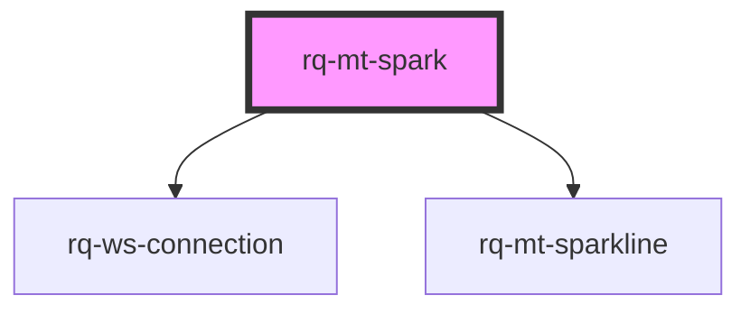

# rq-mt-spark

<!-- Auto Generated Below -->

## Properties

| Property     | Attribute     | Description | Type                                                                                                                                                                    | Default         |
| ------------ | ------------- | ----------- | ----------------------------------------------------------------------------------------------------------------------------------------------------------------------- | --------------- |
| `connection` | --            |             | `WebsocketConnection \| { endpoint: string; apiKey: string; apiHost: string; channels: string \| string[] \| Set<string>; snapshot?: boolean; env?: "dev" \| "prod"; }` | `undefined`     |
| `display`    | `display`     |             | `"default" \| "reverse"`                                                                                                                                                | `'default'`     |
| `maxHistory` | `max-history` |             | `number`                                                                                                                                                                | `30`            |
| `namespace`  | `namespace`   |             | `string`                                                                                                                                                                | `"rq-mt-spark"` |
| `symbol`     | --            |             | `{ key: string; label: string; }`                                                                                                                                       | `undefined`     |

## Dependencies

### Depends on

- [rq-ws-connection](../rq-ws-connection)
- [rq-mt-sparkline](../rq-mt-sparkline)

### Graph

----------------------------------------------

*Built with [StencilJS](https://stenciljs.com/)*
