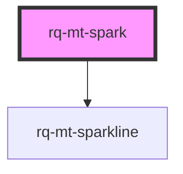

# rq-mt-spark

<!-- Auto Generated Below -->

## Properties

| Property     | Attribute     | Description | Type                                             | Default         |
| ------------ | ------------- | ----------- | ------------------------------------------------ | --------------- |
| `maxHistory` | `max-history` |             | `number`                                         | `30`            |
| `namespace`  | `namespace`   |             | `string`                                         | `"rq-mt-spark"` |
| `symbol`     | --            |             | `{ key: string; label: string; image: string; }` | `undefined`     |

## Dependencies

### Depends on

- [rq-mt-sparkline](../rq-mt-sparkline)

### Graph

----------------------------------------------

*Built with [StencilJS](https://stenciljs.com/)*
