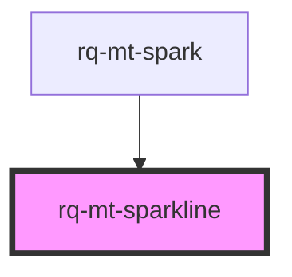

# rq-mt-sparkline

<!-- Auto Generated Below -->

## Properties

| Property      | Attribute      | Description | Type       | Default |
| ------------- | -------------- | ----------- | ---------- | ------- |
| `labels`      | --             |             | `string[]` | `[]`    |
| `maxElements` | `max-elements` |             | `number`   | `31`    |
| `values`      | --             |             | `number[]` | `[]`    |

## Methods

### `appendData(label: string, data: number) => Promise<void>`

#### Parameters

| Name    | Type     | Description |
| ------- | -------- | ----------- |
| `label` | `string` |             |
| `data`  | `number` |             |

#### Returns

Type: `Promise<void>`

## Dependencies

### Used by

-   [rq-mt-spark](../rq-mt-spark)

### Graph

---

_Built with [StencilJS](https://stenciljs.com/)_
