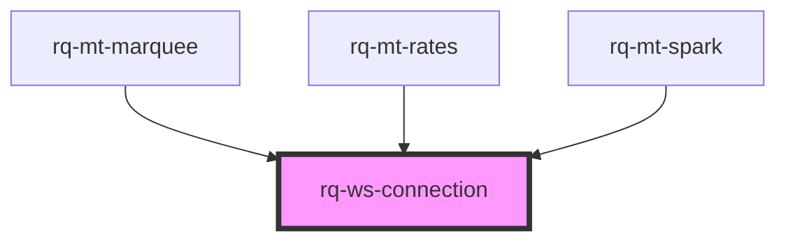

# rq-ws-connection

<!-- Auto Generated Below -->

## Properties

| Property     | Attribute  | Description | Type                                                                                                                                                                                                                               | Default     |
| ------------ | ---------- | ----------- | ---------------------------------------------------------------------------------------------------------------------------------------------------------------------------------------------------------------------------------- | ----------- |
| `connection` | --         |             | `WebsocketConnection \| { endpoints: string \| string[]; apiKey: string; apiHost: string; channels: string \| string[]; snapshot?: boolean \| "asc" \| "desc"; snapshot_size?: number; user_id?: string; env?: "dev" \| "prod"; }` | `undefined` |
| `snapshot`   | `snapshot` |             | `"asc" \| "desc" \| boolean`                                                                                                                                                                                                       | `undefined` |

## Events

| Event          | Description | Type                                                           |
| -------------- | ----------- | -------------------------------------------------------------- |
| `rqComplete`   |             | `CustomEvent<[cid: string]>`                                   |
| `rqConnected`  |             | `CustomEvent<[cid: string, message: ClientConnectedMessage]>`  |
| `rqData`       |             | `CustomEvent<[cid: string, message: ClientMessage<unknown>]>`  |
| `rqError`      |             | `CustomEvent<[cid: string, error: Error]>`                     |
| `rqOpen`       |             | `CustomEvent<[cid: string]>`                                   |
| `rqReady`      |             | `CustomEvent<[cid: string, channels: Set<string>]>`            |
| `rqSnapshot`   |             | `CustomEvent<[cid: string, data: unknown]>`                    |
| `rqSubscribed` |             | `CustomEvent<[cid: string, message: ClientSubscribedMessage]>` |

## Methods

### `fetchSnapshot<T = unknown>() => Promise<T>`

#### Returns

Type: `Promise<T>`

### `getConnection() => Promise<WebsocketConnection>`

#### Returns

Type: `Promise<WebsocketConnection>`

## Dependencies

### Used by

 - [rq-mt-marquee](../rq-mt-marquee)
 - [rq-mt-rates](../rq-mt-rates)
 - [rq-mt-spark](../rq-mt-spark)

### Graph

----------------------------------------------

*Built with [StencilJS](https://stenciljs.com/)*
